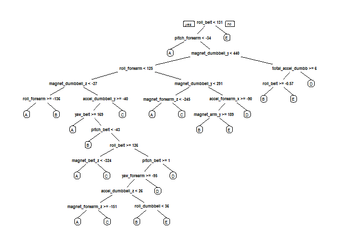

## load the data and the packages into R:

```r
library(caret)
library(randomForest)
library(rpart)
library(rpart.plot)
library(rattle)
```

## Getting and cleaning data 

```r
if (!file.exists("pml-training.csv" )){
        fileUrl = "https://d396qusza40orc.cloudfront.net/predmachlearn/pml-training.csv"
        download.file(fileUrl, destfile="./pml-training.csv")
}

if (!file.exists("pml-testing.csv" )){
        fileUrl = "https://d396qusza40orc.cloudfront.net/predmachlearn/pml-testing.csv"
        download.file(fileUrl, destfile="./pml-testing.csv")
}
```


```r
# Read in the data:
trainingData <- read.csv("pml-training.csv", header = TRUE, sep = ",", na.strings = c("NA", ""))
testingData <- read.csv("pml-testing.csv", header = TRUE, sep = ",", na.strings = c("NA", ""))
```


```r
# Remove variables with near zero variance
training<-trainingData[,colSums(is.na(trainingData)) == 0]
testing <-testingData[,colSums(is.na(testingData)) == 0]

# Remove columns that are not predictors, which are the the seven first columns
training   <-training[,-c(1:7)]
testing <-testing[,-c(1:7)]
```
# The data after cleaning


```r
dim(training)
```

```
## [1] 19622    53
```

## Cross-validation
#### In order to get out-of-sample errors, split the training data in training (75%) and testing (25%) data) subsets:

```r
set.seed(1234)
inTrain <- createDataPartition(trainingData$classe, p = 0.75, list = FALSE)
training <- training[inTrain,]
testing <- training[-inTrain,]
```
We will run the set on 5-fold cross validation. In 5-fold cross-validation, the original sample is randomly partitioned into 5 equal sized subsamples. Of the 5 subsamples, a single subsample is retained as the validation data for testing the model, and the remaining 4 subsamples are used as training data. The cross-validation process is then repeated 5 times (the folds), with each of the 5 subsamples used exactly once as the validation data. The 5 results from the folds can then be averaged (or otherwise combined) to produce a single estimation.


```r
set.seed(1234)
rfModel <- train(classe ~., method = "rf", data = training, 
                 trControl = trainControl(method = "cv", number= 5), 
                 prox = TRUE, allowParallel = TRUE)

rfModel
```

```
## Random Forest 
## 
## 14718 samples
##    52 predictor
##     5 classes: 'A', 'B', 'C', 'D', 'E' 
## 
## No pre-processing
## Resampling: Cross-Validated (5 fold) 
## Summary of sample sizes: 11774, 11773, 11776, 11775, 11774 
## Resampling results across tuning parameters:
## 
##   mtry  Accuracy   Kappa    
##    2    0.9905561  0.9880522
##   27    0.9915752  0.9893419
##   52    0.9836928  0.9793681
## 
## Accuracy was used to select the optimal model using the largest value.
## The final value used for the model was mtry = 27.
```
## Check performance of model 
The model will be tested on the validation data (partition of the training data) and a confusion matrix will be used to check the accuracy of the prediction on the validation data:


```r
predictTesting <- predict(rfModel, testing)
confusionMatrix(factor(testing$classe), factor(predictTesting))
```

```
## Confusion Matrix and Statistics
## 
##           Reference
## Prediction    A    B    C    D    E
##          A 1040    0    0    0    0
##          B    0  699    0    0    0
##          C    0    0  665    0    0
##          D    0    0    0  603    0
##          E    0    0    0    0  675
## 
## Overall Statistics
##                                     
##                Accuracy : 1         
##                  95% CI : (0.999, 1)
##     No Information Rate : 0.2825    
##     P-Value [Acc > NIR] : < 2.2e-16 
##                                     
##                   Kappa : 1         
##                                     
##  Mcnemar's Test P-Value : NA        
## 
## Statistics by Class:
## 
##                      Class: A Class: B Class: C Class: D Class: E
## Sensitivity            1.0000   1.0000   1.0000   1.0000   1.0000
## Specificity            1.0000   1.0000   1.0000   1.0000   1.0000
## Pos Pred Value         1.0000   1.0000   1.0000   1.0000   1.0000
## Neg Pred Value         1.0000   1.0000   1.0000   1.0000   1.0000
## Prevalence             0.2825   0.1898   0.1806   0.1638   0.1833
## Detection Rate         0.2825   0.1898   0.1806   0.1638   0.1833
## Detection Prevalence   0.2825   0.1898   0.1806   0.1638   0.1833
## Balanced Accuracy      1.0000   1.0000   1.0000   1.0000   1.0000
```


```r
#Accuracy: 
accuracy <- confusionMatrix(factor(testing$classe), factor(predictTesting))$overall[1]

#Out of sample error:
OOSError <- 1 - confusionMatrix(factor(testing$classe), factor(predictTesting))$overall[1]

cat("Accuracy: ", accuracy)
```

```
## Accuracy:  1
```

```r
cat("Out of sample error: ", OOSError)
```

```
## Out of sample error:  0
```

The accuracy from the prediction model is 1 and the out of sample error is 0%. As this is a very accurate result, we will run the Random Forest model on the test data

## Run the model on the test data 
The Random Forest model is now applied to the test data to predict the outcome:


```r
answer <- predict(rfModel, testingData)

answer
```

```
##  [1] B A B A A E D B A A B C B A E E A B B B
## Levels: A B C D E
```

## Appendix


```r
rfModelTree <- rpart(classe ~., data = training, method = "class")
prp(rfModelTree)
```

<!-- -->


